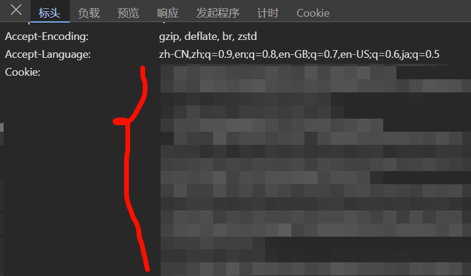

# zhihu_tools

---

# ！！不建议使用！！
寄了家人们，会员直接没了，看了一下，协议里面写了登录设备不能超过5个，同时不能超过2个，这个爬虫的逻辑是随机换ua，估计是这个导致的。。。

同一会员帐号最多可以在五个设备（「设备」包括但不限于手机端、Pad 端、电脑端等的移动终端设备）上登录和使用，且同一时间内同一帐号最多在两个设备上登录和使用。如您超出上述使用限制，知乎有权视您的超出使用情况对您作出限制登录、限制使用、中断或终止服务等处理措施，您需承担因此引起的一切责任和后果。

如未经知乎明确授权，将盐选会员服务提供的全部或部分会员内容进行复制、截图、录屏、爬虫抓取或其他形式展示、传播的，知乎有权限制/取消您的账号/账号使用权限、终止全部或部分会员服务；如您的行为使知乎及/或其关联公司遭受损失的，知乎亦保留追究您赔偿责任的权利，详见《知平盐选会员服务协议》

以下是仓库原文：
##### 知乎严选文章爬虫。


从根本上爬取严选文章。自从去年开始，知乎就改变了网页的规则，这也就导致了出现很多错误，包括但不限于字体错乱...

以前，知乎严选的文章还可在网页上直接观看，但是从2022/23开始，知乎改变了规则，严选文章必须要在手机APP上查看，真不知道他们怎么想的。这种反爬虫措施也想的出来，不过这确实隔绝了很多爬虫小白。有盾就有矛，虽然麻烦了一点但也没有彻底隔绝。

---

## 2024-04-20 代码重构

### 目录树 🤷‍♂️

```
├─answerSpider
│  └─__pycache__
├─config
│  └─__pycache__
├─ddddocr
│  └─__pycache__
├─fakeUserAgent
│  └─__pycache__
├─fontPreview
│  └─__pycache__
├─main
│  └─__pycache__
└─marketSpider
    └─__pycache__
```

### 开发计划 😘

- [X] fake请求头随机获取 👌
- [X] 解决字体错乱 👌
- [ ] 单一question链接爬取
- [X] 单一market链接爬取 👌
- [ ] 整合一本书爬取
- [ ] 图形页面开发
- [ ] 搜索关键词爬取

### 如何使用？ 😶‍🌫️

    - python3环境
    - 正常的脑子 🧠
    - 至少小学的语文水平 📚
    - 需要自备盐选会员

#### 下载此项目文件到本地

    1. 打开cmd
    2. cd到项目文件目录
    3. 在config.ini文件中填写你的cookie（直接随便一个请求头里复制一整个非常非常长的Cookie，不是应用程序里面找）
    4. python main/spider.py




#### 选项1

 1. 选项1用来爬取知乎带有question的严选文章，这在以前倒是没有什么困难获取到链接，但是现在知乎改变了规则，从Appe复制的链接是不带有question关键词的，而是带有soia关键词的，也就是另外一个App的内容了。不过方法总比困难多，你可以抓包获取带有question的链接。目前选项1闲置中。

#### 选项2
  1. 选项2用来爬取知乎带有market的文章内容。链接也还是通过抓包获取到的。这个选项是可以使用的。
  2. 链接示例：https://www.zhihu.com/market/paid_column/1702723501155422208/section/1788920608135983104

#### 选项3
  1. 一本完整的严选书籍爬取。什么时候想做了再做吧。

#### 选项4
   1. 这个选项是用来爬取带有关键词的严选文章，通常在网页端打开链接，看到最后会要求在App中查看并且给出了一个关键词让你去搜索，这个选项是用来解决这个问题的。什么时候想做了再做吧。


#### 报错？🤡

##### 1. module not found

- pip install 

#### 1. 无法爬取？🤡🤡

- 这是一个盐选文件获取的项目。不是无中生有破解知乎
- 首先要有的就是一个盐选账号。

  - 需要获取到账号的cookie复制到config.ini文件。然后运行main文件中的spider.py即可
- 知乎提示需升级版本
  - User-Agent 不是手机或者是无用的User-Agent
  - 如何获取一个User-Agent？
    1. 手机抓包。打开知乎然后随意一条请求复制其中的内容到config.ini文件中含有User-Agent的值后
    2. 运气。项目提供上百个User-Agent。如果一次运行失败建议再运行一次

1. 未知错误
   - 提ISSUE.
   - [怎么提问?](https://github.com/ryanhanwu/How-To-Ask-Questions-The-Smart-Way)

#### 这个项目有什么用？🤷‍♂️

- 获取盐选文章到本地观看. 除此之外没有任何用

---

**所看皆可爬**
